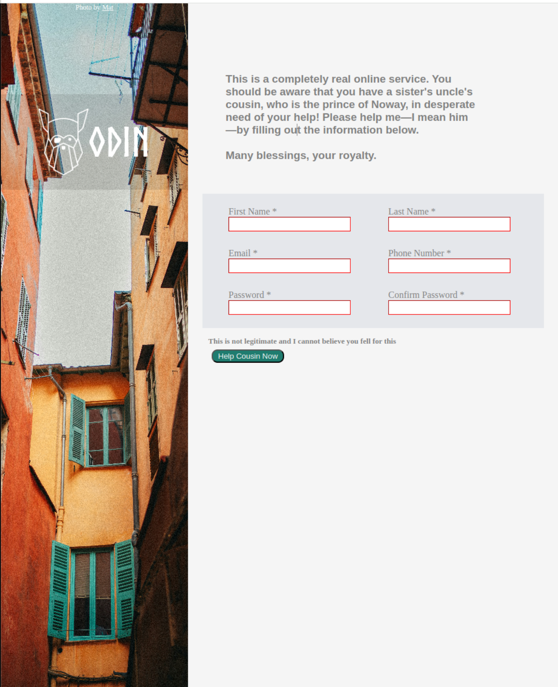

  

  <h1 align="center"><b>Sign-up Form</b></h1>

 

## Preview

 

<a href="https://fubiknees.github.io/signUpForm/">View Demo</a>
 

## Goal

* Employ form validation in a basic webpage

* [Assignment Details](https://www.theodinproject.com/lessons/node-path-intermediate-html-and-css-sign-up-form)

 

## Built With

*    
*    
* 

 

## Takeaways

* Further experience designing forms while applying validation

 

## Improvements

* This initial page was a great start but I would love to create a more professional version with features like: animation, better responsiveness for both Desktop/Mobile, higher level design. 

